# Future RM — Production Architecture

How this clickable prototype would map to a real, production-grade system, **aligned to
Lloyds Banking Group's own North Star** (the REO agent on LBG GCP, OneView365 CRM, the
Ring 1/2/3 data model and the A2A | MCP | REST integration fabric). The prototype's ideas
— always-on intelligence, the digital twin, the agent bench, deal orchestration — are
expressed here in LBG's chosen technology so the path from demo to delivery is concrete,
not generic.

> Where our prototype said *"WorkIQ / intelligence engine"*, LBG's stack says **REO** —
> the LBG Agent (built on Microsoft Copilot Studio, hosted on **LBG GCP**) that does
> agent selection, planning, context routing and **LBG RAI policy checks**. We adopt that
> naming throughout.

## The shape of it — on LBG's North Star

```mermaid
flowchart TB
    subgraph TRIGGERS["Invocation triggers"]
        T1["User-initiated<br/>RM prompt on OneView CRM"]
        T2["Event-driven<br/>revenue / risk / sentiment / M&A signals"]
        T3["Scheduled<br/>7am pre-meeting brief, pipeline digest"]
        T4["System-to-system<br/>external workflows & agents"]
    end

    subgraph CHANNELS["Access channels"]
        HUMAN["Human-facing<br/>OneView CRM · Teams · Outlook · Web · Mobile · M365 Copilot"]
        SYSTEM["System-facing<br/>Power Automate · APIs · Event Grid · Scheduler · Webhooks"]
    end

    subgraph GCP["LBG GCP"]
        subgraph REO["REO — LBG Agent (on MS Copilot Studio)"]
            ORCH["Orchestrator / Workflow Engine<br/>agent selection · plan & execute · context routing · LBG RAI policy checks"]
            SKILLS["Agents / Skills<br/>scalable agentic architecture"]
            KNOW["Knowledge / Context store<br/>Vector DB · Context DB · Reference"]
            TOOLS["Tools"]
        end
        R1["Ring 1 — Microsoft products<br/>OneView CRM · Outlook · OneDrive · Teams"]
        R2["Ring 2 — Internal data<br/>Products · Pricing · Alerts · One MI · Servicing"]
    end

    subgraph EXT["External · A2A | MCP | REST"]
        EXTAGENTS["M365 Copilot · Sales Agent · Analyst Agent · Researcher · rogo"]
        R3["Ring 3 — External data<br/>Companies House · Capital IQ · D&B · IBIS World · SEC"]
    end

    GOV["LBG RAI · audit & lineage · entitlements"]

    T1 --> HUMAN
    T2 --> SYSTEM
    T3 --> SYSTEM
    T4 --> SYSTEM
    HUMAN --> ORCH
    SYSTEM --> ORCH
    ORCH --> SKILLS
    SKILLS --> TOOLS
    ORCH --> KNOW
    SKILLS --> R1
    SKILLS --> R2
    TOOLS -->|A2A · MCP · REST| EXTAGENTS
    TOOLS -->|A2A · MCP · REST| R3
    GOV -.-> ORCH
```

## Layer by layer (mapped to the North Star)

**1. Invocation triggers** — the prototype's "always-on" behaviour is, in LBG's model,
four trigger classes feeding REO: **user-initiated** (an RM prompt in OneView CRM),
**event-driven** (revenue-change, risk & sentiment, engagement-shift — and, in our M&A
story, a Companies-House change-of-control signal), **scheduled** (the 7am pre-meeting
brief, the weekly account-change digest), and **system-to-system** (external workflows
and agents). Opportunity Ignition and the Radar are simply event-driven + scheduled
triggers surfaced to the RM.

**2. Access channels** — the same React/PWA we prototyped is one of several **human-facing
channels** (OneView CRM, Teams, Outlook, Web, Mobile, M365 Copilot); the digital twin is
how REO presents itself inside those surfaces. Alongside sit **system-facing channels**
(Power Automate, APIs, Event Grid, Scheduler/Batch, Webhooks) that let REO act
autonomously and integrate without a human in the loop. Interaction modes — click, form,
approvals, alerts, search, suggestions, **voice** — cover the in-meeting mobile moment.

**3. REO — the LBG Agent (on LBG GCP, built on MS Copilot Studio)**
- **Orchestrator / Workflow Engine** — agent selection, plan & execution, context
  routing, and **LBG RAI policy checks** on every step. This is where the prototype's
  human-in-the-loop gates live: REO plans the work but RAI + approval gates decide what
  can act vs only propose.
- **Agents / Skills** — the "scalable agentic architecture": each capability on our Agent
  Bench (meeting prep, credit-pack draft, pricing recommendation, fulfilment) is a REO
  skill with a typed contract and a permission scope (autonomous / human-in-loop /
  RM-only map straight onto these scopes — the pricing Override is the canonical HITL
  skill).
- **Knowledge / Context store** — Vector DB + Context DB + Reference data provide the
  grounding behind every answer (the source chips in the twin). Retrieval is
  entitlement-filtered so the RM only sees what they're permitted to.

**4. Grounding data — the three rings.** REO grounds answers on LBG's ring model rather
than a single lake:
- **Ring 1 — Microsoft products data:** OneView CRM, Outlook, OneDrive, Teams.
- **Ring 2 — internal data:** Products, Pricing, Alerts, One MI, Servicing — the source
  of the deal-strip metrics (value, RoRWA, win-probability inputs).
- **Ring 3 — external data:** Companies House, Capital IQ, D&B, IBIS World (and SEC /
  Crunchbase / Bing) — reached over **A2A | MCP | REST**. In the M&A scenario this is the
  ring that detects the acquisition (press + change-of-control filing).

**5. External agents & third-party AI** — REO doesn't have to do everything itself. Over
the same A2A | MCP | REST fabric it delegates to **M365 Copilot, the Sales Agent, Analyst
Agent and Researcher**, and to third-party SaaS AI such as **rogo** — an agent-to-agent
pattern that keeps REO as the accountable orchestrator while reusing best-of-breed skills.

**6. OneView365 as a headless, event-sourced CRM** — the prototype's "glass pipe /
headless CRM / no re-keying" is delivered by treating OneView365 as a **downstream
consumer**: REO writes the record once via REST/HTTPS, and Event Grid / Power Automate /
webhooks fan the same event out to pipeline, servicing and MI — so nothing is keyed twice
and the CRM runs in the background.

## The bits that matter most in a bank

These separate a demo from something Lloyds could actually run — and most are already
named in the North Star:

- **LBG RAI policy checks, in the orchestrator** — RAI is not a side-car; it runs inside
  REO's workflow engine on every step. The Accept/Override pattern keeps a regulated
  decision (pricing, credit) with an accountable human: agents propose, the RM disposes.
- **Grounding on the rings = explainability** — every AI assertion traces back to Ring 1,
  2 or 3 (the source chips). No ungrounded answers; the ring is the citation.
- **Model risk & audit** (SR 11-7, PRA SS1/23, FCA Consumer Duty) — every REO plan,
  prompt, skill call and external (A2A/MCP) hop logged with lineage for validation and
  challenge.
- **Entitlements & data residency** — GDPR plus row/column-level entitlements enforced at
  retrieval, so REO physically cannot surface out-of-scope client data; sensitive data
  stays within the LBG GCP boundary, external sources reached read-only over MCP/REST.
- **Evals & guardrails** — automated eval harness, prompt-injection defence and
  groundedness scoring gating every release of a REO skill.
- **MLOps / LLMOps** — versioned skills and models, shadow/A2A deployment, drift
  monitoring (the in-app v1/v2 toggle is the toy version of this).

## Build vs buy (per LBG's capability assessment)

The client's own Build/Buy view already triages this, and the architecture respects it:

- **Build** — REO (the LBG Agent + orchestration) on MS Copilot Studio / LBG GCP, plus
  the bank-specific skills (credit pack, pricing/RoRWA, OneView writes) where IP and
  control matter.
- **Buy / reuse** — M365 Copilot, Sales Agent, Analyst Agent and Researcher for
  general-purpose productivity and research; **rogo** as a third-party SaaS AI solution;
  external data via Companies House, Capital IQ, D&B, IBIS World. All integrated through
  REO over A2A | MCP | REST rather than rebuilt.

## How the prototype maps

| Prototype | LBG North Star equivalent |
|---|---|
| Always-on intelligence engine ("WorkIQ") | **REO** orchestrator + invocation triggers (event-driven / scheduled) |
| Digital twin chatbot | REO surfaced through OneView CRM / M365 Copilot / Mobile |
| Source chips | Grounding on Ring 1/2/3 with lineage |
| Agent Bench tiers (autonomous / HITL / RM-only) | REO Agents/Skills with permission scopes + LBG RAI gates |
| Pricing Accept/Override | Human-in-the-loop RAI gate in the workflow engine |
| Win-prob / RoRWA metrics | Ring 2 internal data (Products, Pricing, One MI) + models |
| Opportunity Ignition / Radar | Event-driven + scheduled triggers (revenue/risk/M&A signals) |
| M&A detection (Companies House change-of-control) | Ring 3 external data over A2A · MCP · REST |
| "Glass pipe / headless CRM / no re-keying" | OneView365 as an event-sourced downstream consumer (Event Grid / Power Automate / webhooks) |
| Delegating to specialist agents | External agents (Sales/Analyst/Researcher, rogo) via A2A/MCP |
| v1/v2 toggle | Skill/model versioning & shadow deploys |

## A sensible build sequence

1. **Triggers, channels & entitlements first** — wire REO to OneView CRM + Event Grid and
   the Ring 1/2 data, with RAI policy checks and entitlements live. Nothing intelligent
   ships without this.
2. **One signal, one screen** — ship Opportunity Ignition for a single trigger (e.g. an
   M&A / change-of-control event from Ring 3) to prove the trigger → action loop end to
   end.
3. **Grounded twin (read-only)** — REO Q&A with ring-cited sources, *no actions* yet.
   Earns trust and exercises the RAI/eval harness.
4. **First human-in-loop skill** — pricing recommendation with Accept/Override, the
   lowest-risk way to introduce "act" under an RAI gate.
5. **Expand the agent bench + portfolio scale** — add external-agent delegation (Sales /
   Analyst / Researcher / rogo over A2A | MCP) and the portfolio radar once governance,
   evals and OneView write-back are proven.
