# Future of Work for the RM — Ideas Catalogue (CIB / BCB)

**Purpose:** Go beyond transcription. Imagine the full future operating model for the Relationship Manager.
**Framing:** Transcription is just the *ear*. These ideas build the rest of the augmented RM.

---

## Three-Horizon Roadmap

| Horizon | Theme | Examples |
|---|---|---|
| **Now (POC)** | Capture → act | Transcription, in-the-moment prompts, auto-summary, agent bench |
| **Next** | Proactive & personal | Opportunity radar, RM twin, relationship graph, generative pitch |
| **Future / Sky** | Augmented RM | Client digital twins, AR meetings, negotiation sandbox, EQ coaching |

> The scoped POC is **Horizon 1** — the gateway to everything below. Pitch: *"What you see today is the foundation; here's the 3-year arc."*

---

## 1. Beyond the Ear — Multimodal "Ambient" Intelligence

- **AR glasses / heads-up display** for F2F: client name, last interaction, live cues in the RM's field of view — no looking down at a device.
- **Whiteboard & document capture**: snap napkin-maths or term-sheet scribbles → structured deal inputs.
- **Body-language / engagement signals** (with consent) on video calls — not just *what* was said but *how it landed*.
- **Ambient room mode** for group meetings: speaker diarisation, who-said-what, who the real decision-maker is.

## 2. The Client's Digital Twin

- A living, modelled version of each client: financials, supply chain, peers, exposures, sentiment, news.
- **"What-if" simulation**: *"If rates move 50bps / EUR exposure doubles / biggest customer defaults — what do they need from us?"*
- The twin **proactively raises its hand** before the RM even thinks to call.

## 3. The RM's Own AI Twin ("Mini-Me")

- An agent that **knows how this RM works, writes, and prioritises** — drafts in their voice, mirrors their judgement thresholds.
- **Covers the long tail**: services the 200 smaller clients an RM can't physically reach, escalating only the moments that matter.
- **Succession / continuity**: when an RM leaves, the relationship memory doesn't walk out the door.

## 4. Proactive Origination — System Hunts, RM Closes

- **Always-on opportunity radar** across the book: funding gaps, refinancing windows, M&A chatter, FX exposure, ESG transition needs.
- **Trigger-based outreach**: client files accounts / opens a new entity / a peer issues a bond → RM gets a pre-built reason to call *today*.
- **Cross-sell orchestration** across product silos (markets, lending, transaction banking) so the client sees *one bank*, not six.

## 5. Relationship Intelligence Graph

- Map the **real human network**: who knows whom, warm-intro paths, hidden influencers across the client's org and the bank.
- **Relationship health score**: frequency, depth, sentiment, single-thread risk (*"this whole £40m relationship rests on one CFO who's leaving"*).
- **White-space map**: where the bank has access but no wallet.

## 6. Generative Deal & Pitch Engine

- *"Build me a working-capital pitch for the Germany expansion"* → tailored deck, pricing scenarios, peer comps, risk view in minutes, in house style.
- **Negotiation sandbox**: rehearse the tough conversation against an AI playing the client's CFO before the real meeting.
- **Live pricing co-pilot** in the room, with guardrails.

## 7. EQ & Coaching Layer (Human-Skills Multiplier)

- **Pre-meeting "brief me like I'm walking in"** — 30-second voice briefing in the RM's ear.
- **Post-meeting coaching**: *"You talked 70% of the time; the buying signal at minute 12 went unaddressed."*
- Develops **junior RMs faster** by codifying what the best ones do.

## 8. Institutional Memory That Never Forgets

- Every interaction, decision, and rationale becomes searchable org knowledge.
- *"What did we promise this client in 2023? Why did we decline the last facility?"* — answered instantly.
- Kills the "knowledge leaves with the person" problem.

## 9. Client-Facing Co-Pilot (Shared Surface)

- A **transparent** view the client also sees — shared action tracker, *"here's what we're working on for you."*
- Turns trust from a black box into a visible, living relationship.

---

## Mapping Ideas → Horizons

```mermaid
flowchart LR
    subgraph NOW[Now - POC]
        T[Transcription + prompts]
        S[Auto-summary]
        AB[Agent bench]
    end
    subgraph NEXT[Next]
        OR[Opportunity radar]
        RT[RM twin]
        RG[Relationship graph]
        GP[Generative pitch]
        IM[Institutional memory]
    end
    subgraph SKY[Future / Sky]
        DT[Client digital twin]
        AR[AR meetings]
        NS[Negotiation sandbox]
        EQ[EQ coaching]
        CC[Client co-pilot]
    end
    NOW --> NEXT --> SKY
```

---

## Why It Lands for CIB / BCB

- **CIB** — digital twins, opportunity radar and the pitch engine all serve *bringing deal ideas early*.
- **BCB** — the RM twin, agent bench and relationship graph deliver *knowing the business at scale* across large books.
- **Both** — every idea ultimately protects and expands time for **Tier 3 human work**: trust, judgement, and the hard conversations clients expect their RM to lead.
