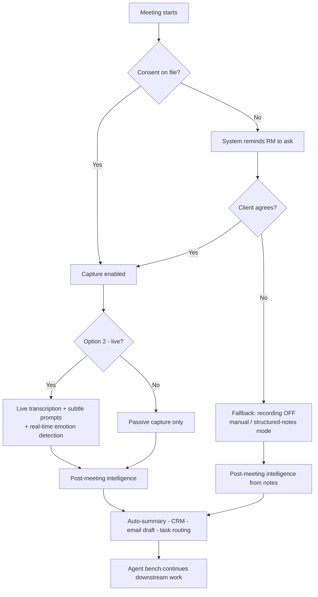

# POC Scoping — Capture Options & Feature Breakdown

**Context:** Future of work for the RM in CIB / BCB.
**Assumption:** RM either has client consent on file, or the system reminds the RM to collect it. If consent is declined, the flow **falls back to no recording**.

---

## Recommendation (Summary)

Build **Option 2 (live transcription + subtle prompts) as the hero path**, because its no-consent fallback naturally collapses into **Option 1 (passive + post-meeting intelligence)** behaviour. One branching build demonstrates **both options**:

- **Consent given** → full live experience (Option 2)
- **Consent declined** → graceful fallback delivering post-meeting intelligence (Option 1)

This tells the whole future-of-work story *and* handles the compliance reality without building two separate demos.

---

## Shared Component — Consent Gate (build once, used by both)

Runs at meeting start:

- RM has consent on file → proceed with capture
- No consent on file → system reminds RM to ask
- Client declines → **fallback: recording off**, manual / structured-notes mode only

Same module for both options — build once, use as the credibility opener in the demo.

---

## Option 1 — Passive Capture + Post-Meeting Intelligence

*Lower risk, "always-on coverage" story. Intelligence lands after the meeting.*

| Feature | In POC? | Notes |
|---|---|---|
| Consent gate + reminder | ✅ Hero | Opens the flow |
| Passive audio capture | ✅ Hero | Only after consent |
| Post-meeting auto-summary (key moments, priorities) | ✅ Hero | The headline output |
| Detection panel (need, risk, product, urgency) | ✅ Hero | Runs on transcript post-meeting |
| Opportunity detection (working capital / FX) | ✅ Hero | The CIB "deal idea" moment |
| CRM one-view auto-update | ✅ Show | Implied / animated |
| Client email summary draft | ✅ Show | Ready for approval |
| Internal task routing (credit / product / ops) | ✅ Show | Implied |
| **Fallback — no recording** | ✅ Hero | RM types / voice-notes key points → system *still* structures them into CRM + summary. Proves graceful degradation. |
| Live in-meeting prompts | ❌ | Not this option |

**POC message:** "Even with zero in-meeting tech intrusion, the RM walks out and everything is already done." Strong for **BCB at-scale coverage**.

---

## Option 2 — Live Transcription + Subtle Prompts

*Higher "wow", future-of-work-in-the-moment story. Needs consent to shine.*

| Feature | In POC? | Notes |
|---|---|---|
| Consent gate + reminder | ✅ Hero | Required before live capture |
| Live transcription | ✅ Hero | Only after consent |
| Real-time detection (need, risk, product, **emotion / tone**) | ✅ Hero | Emotion only works live — unique to this option |
| Subtle on-device prompt (insight + rationale + suggested action) | ✅ Hero | The signature moment |
| Peer / market context prompt | ✅ Hero | "How peers handle expansion risk" |
| Guided-questions prompt (on detected hesitation) | ✅ Show | Ties emotion → RM behaviour |
| Post-meeting summary + CRM + email + task routing | ✅ Show | Same downstream as Option 1 |
| **Fallback — no consent** | ✅ Hero | Live prompts off. Degrades to: **pre-meeting prep prompts only** + manual note capture + post-meeting summary from notes. Effectively becomes Option 1-lite. |
| Continuous passive capture | ❌ | This option is meeting-scoped |

**POC message:** "The system coaches the RM in the moment, then does the admin." Strong for **CIB early deal ideas + judgement augmentation**.

---

## Branching Consent Flow

---

## Why This Works for CIB / BCB

- **CIB** — live opportunity detection (working capital / FX) demonstrates *bringing deal ideas early*.
- **BCB** — agent bench monitoring signals across a book shows *knowing the business at scale*.
- One branching build serves both audiences and both capture options without rebuilding the demo.
